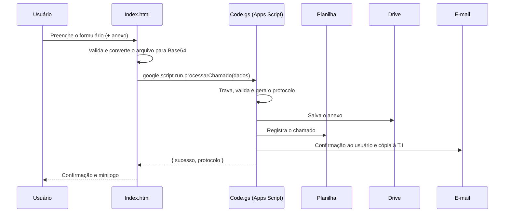

<div align="center">

# Central de Atendimento de T.I

**Sistema de chamados de suporte de T.I, com protocolo, anexos e e-mail automático, feito 100% dentro do Google Workspace.**
Sem servidor, sem banco de dados e sem custo de infraestrutura.


</div>

---

## Visão geral

O colaborador abre o chamado por um formulário web, anexa um print se quiser, recebe o **protocolo** na tela e por e-mail, e a equipe de T.I recebe uma cópia. Tudo fica registrado em uma planilha, e os anexos vão para uma pasta do Drive.

Depois do registro confirmado, a página abre um **minijogo** (estilo dinossauro do Chrome) com o técnico Lucas, feito em Canvas puro.

## Funcionalidades

| Recurso | Detalhe |
|---|---|
| Formulário validado | Campos obrigatórios; somente o anexo é opcional |
| Anexos | PNG, JPG, PDF, DOC e DOCX, até 5 MB, salvos no Drive com link na planilha |
| Protocolo | `TI-aaaaMMdd-HHmmss`, único, gerado sob trava |
| E-mail | Confirmação para quem abriu e cópia opcional para T.I e gestão |
| Anti-duplicidade | Botão travado durante o envio, trava no servidor e aviso se a resposta demorar |
| Confiabilidade | Se o anexo falhar, nada é registrado; se o e-mail falhar, o chamado é mantido |
| Segurança | Validação no servidor, lista de tipos permitidos e proteção contra fórmulas na planilha |
| Interface | Responsiva, sem bibliotecas externas, funciona dentro de iframe (Google Sites) |
| Minijogo | Só abre após sucesso real do servidor; a tecla Espaço é interceptada apenas com o jogo ativo |

## Como funciona



## Estrutura

| Arquivo | Função |
|---|---|
| `Index.html` | Front-end completo (HTML, CSS e JavaScript, sem dependências) |
| `Code.gs` | Back-end: `doGet` e `processarChamado` |
| `appsscript.json` | Manifesto (fuso horário, permissões e publicação como Web App) |

## Instalação

1. Crie uma **planilha** no Google Sheets. Na primeira linha, coloque os cabeçalhos:
   `Protocolo · Data/Hora · E-mail · Nome · Setor · Tipo de Ocorrência · Categoria · Impacto · Urgência · Descrição · Anexo`
2. Na planilha, abra **Extensões → Apps Script** (o projeto fica vinculado a ela).
3. Crie os arquivos `Code.gs`, `Index.html` (tipo HTML) e cole o conteúdo. Em **Configurações do projeto**, mostre e edite o `appsscript.json`.
4. Ajuste o `CONFIG` no `Code.gs` (veja abaixo).
5. **Implantar → Nova implantação → App da Web**, executando **como você**, com acesso restrito à sua organização.
6. Autorize as permissões (Planilhas, Drive e envio de e-mail).
7. Opcional: incorpore a URL `/exec` em uma página do Google Sites (**Inserir → Incorporar → Por URL**).

## Configuração

| Chave | Descrição |
|---|---|
| `ABA` | Nome da aba de destino. Vazio usa a primeira aba |
| `PASTA_ANEXOS_ID` | ID de uma pasta do Drive. Vazio cria "Anexos - Suporte de T.I" automaticamente |
| `EMAIL_TI` | E-mail(s) que recebem cópia de cada chamado, separados por vírgula |
| `EMAIL_DIRETORIA` | Opcional: e-mail(s) de acompanhamento da gestão |
| `TAMANHO_MAX` | Limite do anexo em bytes (padrão 5 MB) |

Personalize também, no `Index.html`, a lista de **departamentos** e os textos institucionais.

## Contrato de dados

Objeto enviado por `google.script.run.processarChamado(dados)`:

```js
{
  email, nome, setor, tipoOcorrencia, categoria, impacto, urgencia, descricao,
  arquivo: null | { bytes /* Base64 */, mimeType, nome }
}
```

Retorno: `{ sucesso: true, protocolo, emailEnviado, anexoSalvo }` ou `{ sucesso: false, erro }`.

## Segurança e privacidade

- **Nenhuma credencial ou ID fica no código.** Planilha, pasta e e-mails são definidos por você na sua conta.
- Publique o Web App restrito à sua organização, não como "Qualquer pessoa".
- Os dados dos chamados ficam somente na sua planilha e no seu Drive.
- Textos que começam com `=`, `+`, `-` ou `@` são neutralizados antes de entrar na planilha.

## Limitações conhecidas

| Limite | Efeito |
|---|---|
| Cota do `MailApp` (varia por tipo de conta) | Cada chamado usa até 2 e-mails por dia da cota |
| Anexos de até 5 MB | Limite prático do envio em Base64 pelo `google.script.run` |
| Uma trava global de execução | Chamados simultâneos são processados em fila, em segundos |

## Licença

[MIT](LICENSE) © 2026 Lucas T.I
